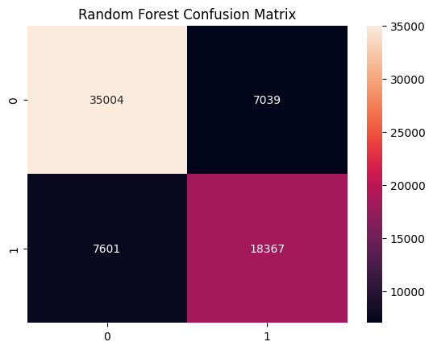
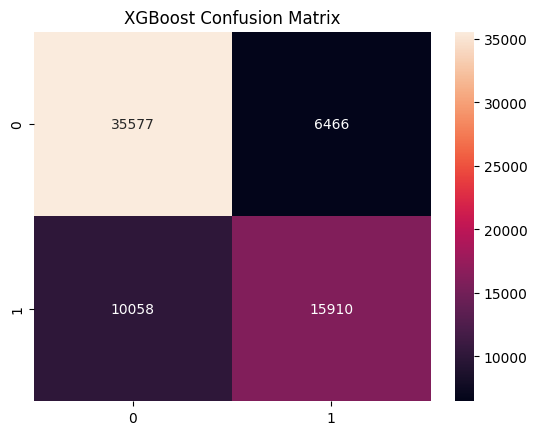

#  Paraphrase Detection using Machine Learning (Quora Question Pairs)

This project focuses on identifying **whether two given questions are paraphrases** of each other — i.e., they convey the same meaning — using classical machine learning models. The dataset used is the [Question Pairs Dataset](https://www.kaggle.com/datasets/quora/question-pairs-dataset/data).

---

##  Objective

To build a binary classification model that predicts whether two questions are paraphrases or not, using traditional ML techniques like:
- **Random Forest**
- **XGBoost**

---

##  Dataset

-  Source: [Kaggle - Question Pairs Dataset](https://www.kaggle.com/datasets/quora/question-pairs-dataset/data)
-  Columns Used:
  - `question1`
  - `question2`
  - `is_duplicate` (Target)


---

##  NLTK Resources Required

Make sure to download the following NLTK data before running:

```python
import nltk
nltk.download('punkt')
nltk.download('stopwords')
nltk.download('wordnet')
```

---

##  Preprocessing Steps

-  Remove null values and empty strings
-  Limit question length to 500 characters
-  Remove questions containing numbers
-  Lowercasing, tokenizing, removing stopwords
-  Lemmatization using NLTK
-  Feature Extraction using `TF-IDF`
-  Jaccard Similarity added as a numeric feature

---

##  Feature Engineering

We used the following features:
- **TF-IDF Vectorization** on both `question1` and `question2`
- **Jaccard Similarity** between token sets of both questions
- Combined into one feature matrix for training

---

##  Models Used

### 1. **Random Forest Classifier**
### 2. **XGBoost Classifier**


##  Analysis & Discussion

Both models performed well in detecting paraphrase relationships in the Quora dataset.

- The **Random Forest** model achieved an accuracy of `~78.5%`, slightly outperforming XGBoost.
- The **XGBoost** model achieved `~75.7%` accuracy but had a more balanced performance in detecting true paraphrases.

The differences in performance are likely due to:
- The ensemble nature of Random Forest handling sparse TF-IDF vectors better.
- XGBoost may benefit more from parameter tuning and deeper preprocessing (e.g., n-grams, embeddings).

The confusion matrices reveal:
- A tendency to **predict "not duplicate" more often**, likely due to **class imbalance** in the dataset (more non-paraphrase pairs).
- Despite this, both models capture semantic similarity fairly well using **TF-IDF + Jaccard similarity**.


---

This project intentionally focuses on **classical ML** to:
- Build strong NLP foundations (preprocessing, vectorization, evaluation).
- Avoid long training times and GPU dependency.
- Understand how traditional models perform **without transformers**.


---

## 📷 Sample Output Visualizations

Example confusion matrices from both models:

- **Random Forest**

  


- **XGBoost**

  


---

